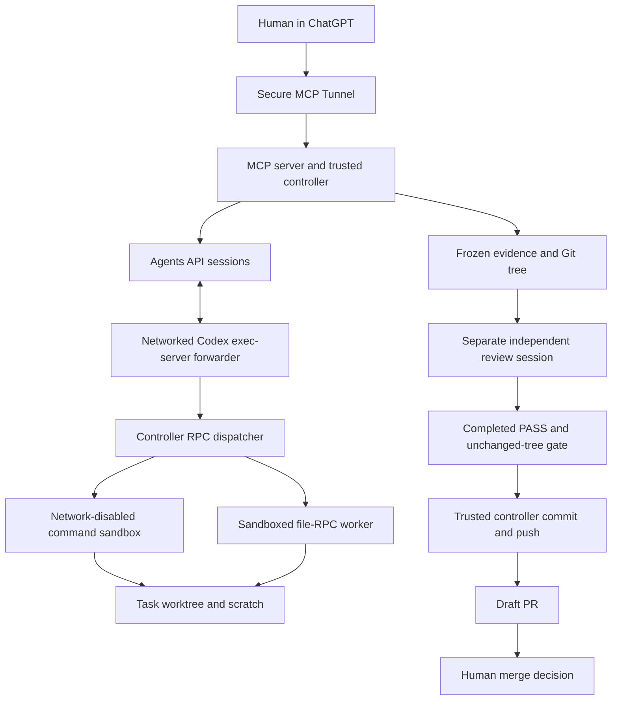

# Architecture and trust boundaries

## Trusted control plane

`server.mjs` defines six strict-purpose MCP tools; `controller.mjs` owns task
lifecycle, sessions, locks, durable records, expiry and review. The server has no
public HTTP listener. `tunnel.py` operates the official outbound tunnel client.
This demonstration assumes a sole authorized owner. Tunnel association checks do
not supply per-user OAuth or multi-tenant authorization.

The host OS, local operator, bridge source/state, Codex binary, controller publisher
and tunnel process are trusted. A local operator can change the program or state;
this is not a defense against a malicious host administrator.

## Repository isolation

`repositories.mjs` resolves operator-registered logical IDs, validates canonical
path and directory/Git identities, and rejects the bridge source and overlapping
state/workspace paths. Callers never supply arbitrary repository paths. A pinned
commit is fetched into a task-private Git store with no shared writable objects or
copied source hooks/configuration. A unique branch and worktree are created there.
The ordinary checkout, its dirty files, and its Git administration are not copied
as implementation inputs or modified. Registration does not relax contract scope.

## Execution and information flow

The Agents API handles the model loop; the self-hosted Codex executor handles local
execution. The outer transport needs network access. Repository commands and file
mutations are dispatched through a different, kernel-enforced boundary, described
below. That distinction is delivered as controller-generated startup attestation.
A label such as `danger-full-access` on the outer transport is not the effective
command policy. Missing enforcement evidence stops implementation.

Broad filesystem reads are allowed for repository tasks. The sandbox confines
writes and command networking; it is **not a confidentiality boundary**. Files
read by the agent may enter model context through the networked transport. Use a
dedicated VM/account without unrelated secrets. Reviewer instructions restrict it
to the packet, but repository-mode read access is not a kernel-level packet-only
restriction. Reviewers have scratch writes only.

Disposable tasks without a repository ID retain the older `isolate.py` Landlock
path. Do not claim repository command-network enforcement for that mode. Neither
mode grants an agent a publishing tool or authority to merge.

## Review, publication and retention

The independent reviewer uses a distinct session, a frozen bounded packet, and
requirement-level findings. Controller observations are separated from API command
records and implementer claims. PASS is necessary but not proof of correctness or
absence of vulnerabilities. No missing finding is automatically upgraded to PASS.

`publication.mjs` is called only by the trusted controller. It verifies the review
packet and exact current worktree state, stops owned executors, permanently freezes
the task, and creates a commit from the reviewed tree using Git objects. No files
are reconstructed through GitHub contents APIs. The commit tree must equal the
reviewed tree before pushing the fixed task branch. An existing unexpected branch
is rejected, including a race caught by the controller's pre-push hook. There is no
force-push, default-branch push or merge operation. The human decides whether to
merge the draft PR. Partial publication is audited and retries reconcile exact
saved identities rather than blindly replaying writes.

SQLite stores task/session ownership, bounded diagnostics, invocation correlation
and publication evidence. Evidence and worktrees live outside the source checkout.
Cleanup can remove the worktree while retaining the bounded task/audit record.
Runtime data is private operational material, even when credential values have
been redacted. It must never be committed to the public source repository.

## Detailed repository evidence and sandbox implementation

### Repository review evidence (version 5)

Before repository task execution, the controller records registry validation and
origin, a normal-checkout snapshot, and the task-private Git state. Review captures
these observations again. Clean and dirty checkouts are compared as they actually
were; neither a clean checkout nor unchanged status alone is assumed sufficient.
Snapshots hash file bytes, paths, modes and change timestamps (including ignored
and untracked files), plus HEAD, index, refs, Git configuration, and Git administration
including reflogs. Git objects are excluded from metadata traversal. Each traversal
is limited to 20,000 entries, 256 MiB and ten seconds; incomplete, unstable or
unreadable snapshots are explicitly unavailable, never evidence of equality.

The packet separates controller observations from bounded Agents API
`command_execution` records. It includes the registered path/identity/origin,
canonical task worktree, private-store mapping and `worktree list --porcelain`,
baseline/HEAD, before/after comparisons, and file byte counts and SHA-256 hashes.
Small nonsensitive files also include complete hexadecimal bytes. All command
records are considered, including commands unrelated to contract test commands;
only bounded fields are retained (100 records / 32 KiB, a 500-item scan ceiling).
Truncation, omitted records and API retrieval failures are explicit. Reasoning and
implementer assertions are not used as controller evidence. The entire redacted
packet remains capped at 128 KiB.

These are observations, not automatic review verdicts. Metadata changes remain
conflicts even if HEAD is unchanged. Local state cannot independently establish
that no remote push occurred. New repository tasks additionally retain the enforced
command/file-RPC sandbox policy and successful startup probes. Only tasks covered
from their first executor receive complete enforcement evidence; resuming a legacy
task does not retroactively establish sandbox coverage. Missing pre-execution snapshots on older tasks cannot be reconstructed
retroactively. Review requirements remain unchanged, and absent/conflicting evidence
must not be silently converted into PASS. Review does not require modifying the implementation worktree.

### Repository command sandbox

`LocalExecutor.start` selects `repository-sandbox.mjs` for repository implementers
and reviewers (including reconnects). Disposable tasks keep the existing
`isolate.py` path. The repository supervisor uses Codex's built-in
`exec-server forward` for networked Agents API transport. A task-private loopback
WebSocket adapter dispatches only explicitly supported RPCs:

- `process/start` launches `codex sandbox -P bridge_task -C <worktree> -- ...`.
  The controller pins the complete permissions table at CLI precedence using a
  controller-owned config. Caller environment variables are applied inside the
  sandbox, never to its launcher. Launch-time shell snapshots, managed-network
  options and other caller-selected sandbox settings are not relayed.
- File RPCs go to a separate stdio exec-server running inside the same sandbox.
  Writes, removes, copies and streaming reads therefore have kernel enforcement.
  Unrecognized RPCs, HTTP proxy requests and configuration/capability discovery
  fail closed. The adapter advertises these unsupported capabilities as disabled.
- Reads are allowed broadly. Writes are limited to the implementer worktree and
  a fresh task-local scratch home/temp directory. The worktree's `.git`, `TASK.md`
  and `.codex` remain read-only. Reviewers receive scratch writes only. The normal
  checkout, private Git store, bridge source/state and trusted config are not
  writable. Agent commands and the file worker receive no API credentials.
- The profile disables command/file-worker networking, including TCP, UDP and
  Unix-socket connections. The transport forwarder remains outside that sandbox.
  No command or file RPC runs through the old Landlock wrapper.

Before connecting the forwarder, startup must prove scratch writes, outside
creation/truncation denial and INET/INET6/Unix connection denial, and initialize
both RPC workers. Failure prevents implementation input submission. Each recorded
attestation contains the policy, profile/config hash, dispatcher and Codex binary
hashes, successful probes and coverage since the first executor. This evidence
never turns a missing or conflicting reviewer finding into PASS.

Requires the installed standalone Codex with `sandbox -P` and `exec-server forward`
and its bundled bubblewrap on a Linux host permitting the required namespaces.
Host namespace permissions and the required Codex runtime must already be available. `ws` supplies the
local WebSocket transport. Local kernel/RPC regression tests require namespace
creation and local test listeners; they fail rather than skip if unavailable.
The adapter deliberately stops on a transport disconnect instead of reusing an
ambiguous RPC/process session. Explicit task continuation can create a fresh
supervisor. No live Agents API compatibility run is part of these local tests.

Repository implementers receive a bounded `controller_repository_sandbox` JSON
attestation in the initial input, after executor readiness and before implementation
submission. It includes task/repository identity, pinned baseline, worktree mapping,
effective profile/hash, successful probes, disabled command networking, writable
roots/read-only exceptions, and command/file-write RPC coverage. Future explicitly
authorized continuations refresh that metadata, including clarification responses.
The controller rejects missing, failed, incomplete or conflicting evidence with
`REPOSITORY_SANDBOX_ATTESTATION_UNAVAILABLE` before submitting implementation input.

The outer harness may display `danger-full-access`, and the dispatcher's own
process result may report `sandboxType=none`: neither describes the nested bridge
command/file-RPC policy. The attestation explains both layers without changing the
outer mode, asking the agent to ignore a discrepancy, or relaxing the task contract.
It is generated from controller startup evidence, not a contract or implementer
assertion. Repository-agent instructions require this evidence and require stopping
on missing/conflicting evidence. No attestation file is added to the worktree.

### File-RPC operation evidence

The repository dispatcher journals every `fs/` request, including unsupported
methods, before dispatch and after completion. Journals are controller-owned under
runtime `sandbox-*/control/`, outside writable agent roots. Atomic replacement and
file synchronization retain pending operations across interruption. Failure to save
the pre-operation observation prevents dispatch. Shutdown seals the journal only
after queued observations settle; a crash, unsealed journal or unknown outcome is
not complete capture. The existing kernel profile remains the security authority.

`file_rpc_operation_evidence` is separate from `command_execution_evidence` in
packets (introduced in version 4). Each record contains a controller-generated operation ID,
per-generation sequence, method, normalized target classifications (`worktree`,
`task_scratch`, `outside`, `unknown`), bounded/redacted relative paths for internal
targets, success/outcome and start/finish timestamps. Copy/rename attempts classify
both source and destination. Outside paths are omitted. Existing symlink ancestors
are resolved for the observation; this is not a claim of race-free path enforcement.
Unsupported rename/write-block requests remain denied, not newly enabled.

No file bytes, request/response bodies, RPC caller IDs, environments, raw errors or
reasoning are journaled. Each generation and the aggregated reviewer section are
bounded to 100 records and 24 KiB of record JSON; the full packet still has its
128 KiB limit. Further operations increment omission counters. Completeness includes
first-executor coverage, expected/observed generation counts, operation/omission
counts, seal status and pending/unknown results. Missing or inconsistent journals
are explicit gaps. A legacy executor cannot acquire retroactive capture coverage.

The controller persists the bounded aggregate in its task record when preparing
review and before cleanup deletes workspace data. It remains available after
controller restart and workspace deletion. Original frozen review packets are not
rewritten. Both command and RPC evidence may be needed for mutation-history
requirements; neither alone is an exhaustive system-call or read audit.

Reviewer instructions evaluate the explicit contract, invariants and enforced
boundaries. Broad-read capability alone is not a scope violation. Observed prohibited
credential/external reads still fail, and an explicit read restriction may fail for
lack of evidence. Missing/truncated/conflicting required RPC evidence is still FAIL;
final file contents do not replace a required edit-operation history. Automated
regressions test packet delivery and preserved simulated reviewer verdicts, not the
behavior of a new live model session.

### Deterministic packet budgeting

Version-5 review packets remain limited to **131,072 UTF-8 bytes**, including keys
and completeness metadata. Serialization is compact JSON. `packet_budget` records
the deterministic section order, measured envelope reserve, and each section's
original/retained bytes, allocation, completeness and representation. Its controller
section retains nested unavailable/conflict/truncated observations; retaining the
section is not a claim that every source observation succeeded.

Contract, identities/baseline, changed-file scope, exact reviewed-tree/file hashes,
controller/sandbox/checkout/Git observations, required test results, RPC evidence
and complete baseline/current maps receive budget before redundant diff text.
Command records have a 30,000-byte collection budget (at most 100 records), leaving
space for their section metadata within 32 KiB. Git-operation records take priority
over required-test and ordinary inspection records, then appear in source order.
Required test results are collected independently of that generic quota, in their
own 32 KiB required section. Source scanning remains limited to 500 items; all
retrieval gaps, omitted records and missing configured tests are explicit.

Inspection `output`, `stdout` and `stderr` are each independently limited to 256
characters. Required test streams retain up to 2,048 characters each. Command and
cwd limits remain unchanged. Original/retained output byte counts, upstream
truncation and per-stream truncation flags prevent a bounded prefix from appearing
complete. Required output details absent from those prefixes must still fail review;
bounded successful exit status is not a substitute for a task's stronger evidence
requirement. The packet builder does not drop required test records to fit.

If a redundant text diff cannot fit, complete baseline/current file maps remain
available for semantic comparison. The diff section explicitly reports omitted
patch bytes and the equivalent representation; it never claims that omitted patch
text was inspected. Binary, symlink, rename and mode-changing patches are not
eligible for this fallback. If required sections (or a non-deduplicable diff) cannot
fit, packet construction fails before reviewer creation rather than sending hashes
alone or silently reducing semantic content.

Size failures include numeric section sizes and the blocking required section in
the MCP error and persisted `review_packet_diagnostic`, also returned by `get_task`.
Early raw-file/capture limits report the measured section or capture ceiling instead
of unavailable later section sizes. Unsafe/oversized-file errors retain their
existing error codes with the additional diagnostic. No diagnostics contain source
content or command output. Existing sandbox, review PASS validation and exact-tree
publication gates are unchanged.
